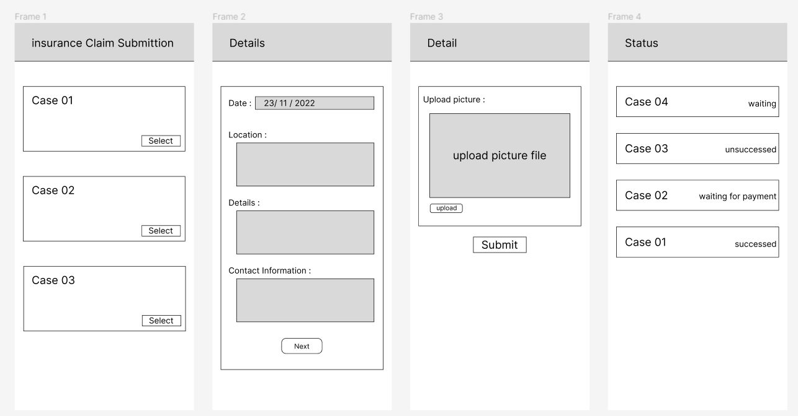
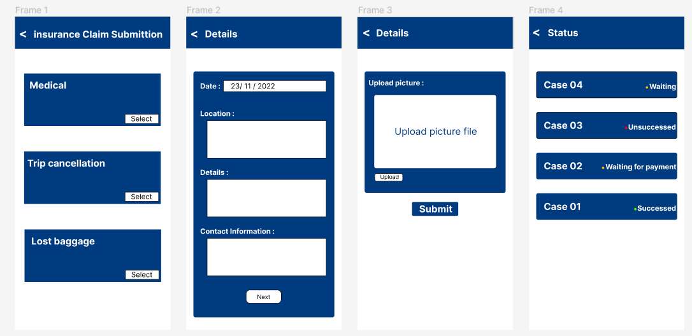

Claims Submission and Tracking:
Implement a user-friendly claims submission and tracking system within the app. Travelers should be able to easily submit claims, upload required documentation (e.g., receipts, medical reports), and track the status of their claims in real-time. A streamlined claims process enhances the overall user experience and builds trust with policyholders.

### URS
URS-001: Users select a type of coverage they want to claim.
URS-002: Users fill in the details of the claim.
URS-003: Users upload pictures of evidence to claim insurance.
URS-004: Users see details of claiming status.
URS-005: Users receive notification status.
URS-006: Users receive a refund from insurance.
URS-007: Users receive the success refund notification.

### SRS
SRS-001: System shows the lists of coverage types.
SRS-002: System show form for user to fill in the information
SRS-003: System receive the claim from the user
SRS-004: System sends the claim details from the user to the insurance company.
SRS-005: System show status of claiming.
SRS-006: System send notification status.
SRS-007: System receive approval from company
SRS-008: System notified that money has been sent.

### UseCase Diagram

### UseCase Description
 

### Activity Diagram

### Non-functional Requirement
1.Performance : 
    => The system should provide quick response times essential functions, including insurance plan comparison and real-time travel alerts.
    => The system should respond to user actions (e.g., plan comparison, document upload) within 2 seconds under normal load conditions.
    => Transactions related to insurance coverage selection should be completed within 5 seconds.
    => The system should handle a high number of concurrent users without significant degradation in performance.
2.Usability : 
    => Users should be able to navigate the app and access important features without requiring a user guide or extensive training.
    => 90% of users should rate the app as "intuitive" or "easy to use" in post-interaction surveys.
    => The app should support at least 5 languages, covering major global regions and demographics.
    => Users should receive updates and important notifications within 24 hours of release.
    =>  The recommendation system should suggest at least 3 relevant insurance providers based on user preferences.
3.Security : 
    => All sensitive user data (e.g., payment information, personal documents) should be encrypted using industry-standard encryption algorithms.
    => The system should pass security audits and penetration tests, identifying no high-severity vulnerabilities.
4.Reliable : 
    => The system should maintain 99.9% uptime during standard operating hours.
    => In case of system failure, data recovery should occur within 2 hours with minimal data loss (<1% of critical data).
5.Scalability : 
    => The system should handle a 20% increase in user base and data volume without degradation in performance or response time.
6.Network Resilience :
    => The system should be designed to maintain functionality and usability even in intermittent or low-connectivity network environments 

### UI (wireframe or prototype)
Link : ( https://www.figma.com/file/4EM1nM9EkyVaAFBGC1kmZC/Untitled?type=design&node-id=3-2&mode=design&t=NRO4t85HCUOBiUTc-0 )

