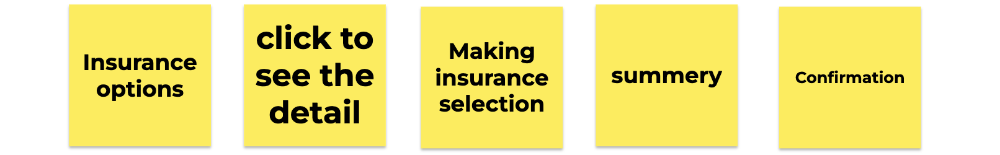
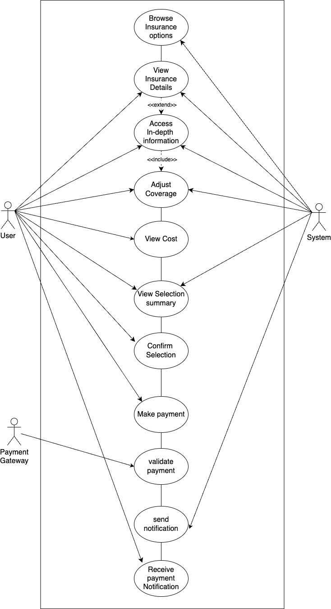
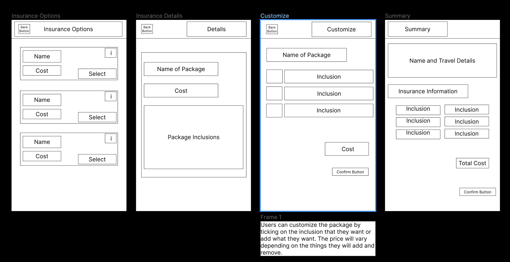
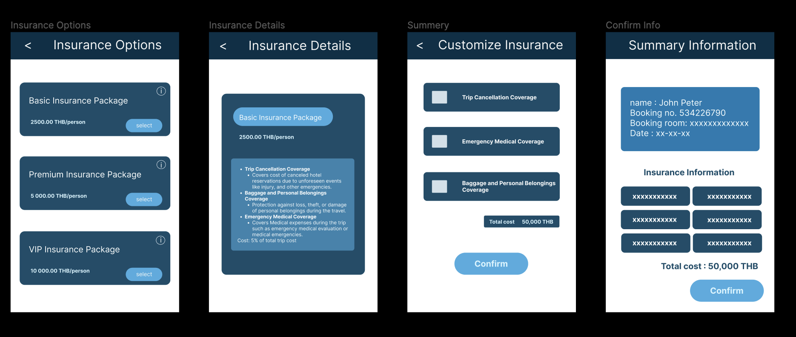

## criteria to prioritize the requirement  
1. User demand : what the user want the most.
2. Performance Enhancers: These are requirements that go beyond the basic functionality of the product and add value by improving performance.
3. Must have feature : essential of the product.
4. Profit : which feature can get the most profit 
5. Delighters: The requirements that are not necessary for the basic functionality of the product but can provide an element of surprise or increase user satisfaction.

## make user journey from the first feature to be implementing via the link below and List document as follows:

first feature to be implement
---

Customizable Insurance and Selection
-Allow users to customize their insurance coverage based on their specific needs and allow them to easily add insurance to their accommodation booking at the check out process.
-Displays clear and in-depth description of what the insurance covers what it includes, and allows a transparent transaction.
---

### URS
URS-01 : Users can look over the insurance options from the given package.
URS-02 : Users can see the insurance options for the details.
URS-03 : User can be access in-depth information about each specific coverage option
URS-04 : Users must be able to adjust their insurance coverage based on their specific need.
URS-05 : The cost of the chosen insurance coverage must be clearly indicated.
URS-06 : User can see summary of their selection 

### SRS
- URS-01 : Users can look over the insurance options from the given package.
  - SRS-01 : System display a list of available insurance options.
- URS-02 : Users can see the insurance options for the details.
  - SRS-02 :  Each listed insurance option must be clickable.

- URS-03 : User can be access in-depth information about each specific coverage option.
  - SRS-03.1 : System shows the details of the options.
  - SRS-03.2 : System should fetch and display the options according to a user's chosen package.

- URS-04 : Users must be able to adjust their insurance coverage based on their specific need.
  - SRS-04.1 : System should provide checkboxes or toggles next to each insurance option
  - SRS-04.2 : System should register and remember the user's selection.

- URS-05 : The cost of the chosen insurance coverage must be clearly indicated.
  - SRS-05 : system immediately recalculate and display the updated cost.

- URS-06 : User can see summary of their selection.
  - SRS-06.1: System shows summary of the user selection.
  - SRS-06.2: System asks user for the confirmation of what the user had selected.

### use case diagram

### use case description
[use case description](usecase-description.pdf)

### activity diagram

### Non-functional requirement 
- usability
  - The system should support both Thai and English language.
  - the text should be readable
  - the process of customize insurance option should not exceed 3 step
- Performance
  - the system must be load available within 2 second
  - Any changes should reflect in a real time , with maximum delay of 1 second
- Avalability
  - If system or network failure, ensure that user informed no data lost
- Security
  - sensitive data such as personal detail related to insurance claim should be encrypted 

### UI (wireframe or prototype)

**wireframe**

**prototype**

